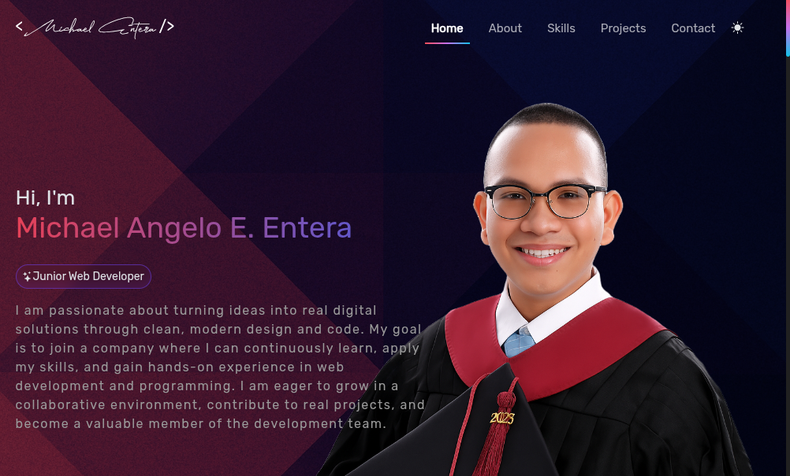

# 👨‍💻 Michael Entera – Junior Web Developer Portfolio

Welcome to my personal portfolio! This site showcases my journey as a Junior Web Developer, the projects I’ve built, the skills I've learned, and the tools I use to create modern, responsive, and meaningful web experiences.

---

## 🚀 Live Site

🔗 [View Live on Vercel](https://vercel.com/michael-enteras-projects)

---

## 🧩 What’s Inside?

- 💼 About Me section with my story and background  
- 🛠️ List of key skills and tools I’ve used in real projects  
- 📁 Project highlights with previews and links  
- 📬 Contact form powered by EmailJS  
- 🎨 Sleek and responsive design using Bootstrap, AOS, and custom CSS  
- ☀️ Dark theme toggle and smooth animations

---

## 🛠 Tech Stack

- HTML5  
- CSS3 / Bootstrap 5  
- JavaScript (Vanilla)  
- AOS (Animate on Scroll)  
- EmailJS (for contact form)  
- Vercel (Deployment)

---

## 📷 Preview

---

## 🧠 Why I Built This

As a passionate IT graduate and aspiring developer, I wanted a platform where I could present my abilities and projects confidently. This portfolio reflects my growth, creativity, and dedication to continuous learning in the tech world.

---

## 📫 Contact Me

You can reach out directly via the **Contact** section in the site or through:

- 📧 Email: `michaelenterax@gmail.com`  
- 🔗 Online Jobs PH: [Michael Entera](https://www.onlinejobs.ph/jobseekers/info/4239711)  
- 🐙 GitHub: [shshshangelo](https://github.com/shshshangelo)

---

## 📄 License

This project is open-source and free to use under the [MIT License](LICENSE).

---

> “Never stop refining your craft. The best code you’ll write is always the next one.” – *Michael Entera*
